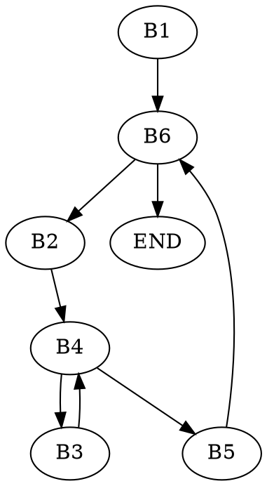

## Zadanie 7

```c=
void insertion_sort(int arr[], int length) {
    int j, temp;
    for (int i = 0; i < length; i++) {
        j = i;
        while (j > 0 && arr[j] < arr[j-1]) {
            temp = arr[j];
            arr[j] = arr[j-1];
            arr[j-1] = temp;
            j--;
        }
    }
}
```asm         
           i    := 0                  ; <<B1>>
           goto TEST_i            
LOOP_i:    j    := i                  ; <<B2>>
           goto TEST_j                
LOOP_j:    t8   := j * 4              ; <<B3>>
           t9   := arr + t8           ; &arr[j]
           Temp := *t9                ; temp = arr[j]
           t10  := j - 1              
           t10  := t10 * 4
           t10  := arr + t10          ; &arr[j-1]
           *t9  := *t10               ; arr[j] = arr[j-1]
           *t10 := Temp               ; arr[j-1] = temp
           j    := j - 1              ; j--
TEST_J1:   t9   := j <= 0
           if t9 goto INCR_i
           t1   := j * 4              ; <<B4>>
           t2   := arr + t1           ; &arr[j]
           t3   := *t2
           t4   := j - 1
           t5   := t4 * 4
           t6   := arr + t3           ; &arr[j-1]
           t7   := *t6
           t8   := t3 < t7            ; arr[j] < arr[j-1]
           if t8 goto LOOP_j       
INCR_i:    i    := i + 1              ; <<B5>>  i++
TEST_i:    if i < length goto LOOP_i  ; <<B6>>
END:
```

