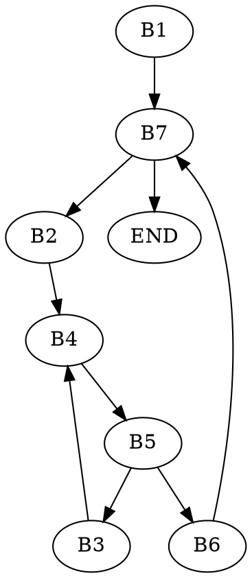

# Lista 1 ASK

## Zadanie 1
```c=
uint32_t copy_bit(uint32_t x, uint32_t i, uint32_t k)
{
    /*
    Krótki przykład i opis metody
    101001101 -- liczba wejściowa

    000000001<<i
    000000100 -- tworzymy maskę, która przechowa informację o bicie na i-tej pozycji
    &________
    000000100

    000000100<<(k-i) -- przesuwamy ten bit na k-tą pozycję
    000100000

    000000001<<k -- przesuwamy jedynkę na k-tą pozycję
    000100000
    ~________ -- negujemy, żeby wyzerować k-ty bit liczby wejściowej, inaczej nie będziemy mogli wkleić tam nowego bitu
    111011111

    101001101 
    111011111
    &________ -- zerujemy k-ty bit otrzymaną wyżej maską
    101001101

    000100000 -- wklejamy ten bit na ktą pozycję liczby wejściowej z wyzerowanym k-tym bitem
    101001101
    |________
    101101101 - skopiowano
    */

    return ((x & (1 << i)) << (k-i)) | (x & ~(1 << k));
}
// uint32_t x = 333;
// uint32_t i = 3;
// uint32_t k = 4;

// printf("%u\n%u\n", 
//         decimal_to_binary(x),
//         decimal_to_binary(copy_bit(x, i, k)));
```

## Zadanie 2
```c=
uint32_t count_ones(uint32_t x)
{

// Traktujemy liczbę x jako tablicę zer i jedynek i szukamy wszystkich jej 
// elementów. Możemy to zrobić, stosując metodę "dziel i zwycieżaj", 
// sumując najpierw elementy z tablic dwuelementowych, później cztero, ośmio,
//  itd. elementowych.
//     0x55555555
//     0101 0101 0101 0101 0101 0101 0101 0101 -- maska, wyciągająca co drugi bit 

//     0x33333333
//     0011 0011 0011 0011 0011 0011 0011 0011 -- maska, wyciągająca pary bitów

//     0x0F0F0F0F
//     0000 1111 0000 1111 0000 1111 0000 1111 -- maska, wyciągająca czwórki bitów

//     0x00FF00FF
//     0000 0000 1111 1111 0000 0000 1111 1111 -- maska, wyciągająca ósemki bitów

//     0x0000FFFF
//     0000 0000  0000 0000 1111 1111 1111 1111 -- maska, wyciągająca szesnastki bitów

//     Będziemy wyciągać w każdej iteracji odpowiednio wszystkie pojedyncze bity, pary bitów, czwórki, ósemki, itd.
// 
// x = 1111 0011 0010 1010 1111 1101 0011 0110
//     1111 0011 0010 1010 1111 1101 0011 0110 >>1 1111 0011 0010 1010 1111 1101 0011 0110
//                                                 0111 1001 1001 0101 0111 1110 1001 1011
//     0101 0101 0101 0101 0101 0101 0101 0101     0101 0101 0101 0101 0101 0101 0101 0101
//     &_______________________________            &_______________________________
//     0101 0001 0000 0000 0101 0101 0001 0100     0101 0001 0001 0101 0101 0100 0001 0001
//     0101 0001 0001 0101 0101 0100 0001 0001
//     +______________________________________     
// x = 1010 0010 0001 0101 1010 1001 0010 0101 -- ten wynik przekazujemy do kolejnej iteracji. 
//     Po ostatniej iteracji otrzymamy w zmiennej x liczbę jedynek w liczbie na wejściu.


    x = (x & 0x55555555) + ((x>>1) & 0x55555555); //dzieli na pojedyncze bity i dodaje je ze sobą
    x = (x & 0x33333333) + ((x>>2) & 0x33333333); //dzieli na pary bitów i dodaje je ze sobą
    x = (x & 0x0F0F0F0F) + ((x>>4) & 0x0F0F0F0F); //dzieli na czwórki bitów i dodaje je ze sobą
    x = (x & 0x00FF00FF) + ((x>>8) & 0x00FF00FF); //dzieli na ósemki bitów i dodaje je ze sobą
    x = (x & 0x0000FFFF) + ((x>>16) & 0x0000FFFF); //dzieli na szesnastki bitów i dodaje je ze sobą

    return x;
}
```

## Zadanie 3

```c=
#include <stdio.h>
#include <stdint.h>
/*
Źródło: https://en.wikipedia.org/wiki/Data_structure_alignment#Data_structure_padding
Elementy są przechowywane w pamięci w sposób uporządkowany, muszą zajmować wielokrotność potęgi dwójki bajtów. Kompilator
próbuje ustawić elementy w pamięci w poprawny sposób, jednak gdy obok siebie znajdują się obiekty o różnym rozmiarze, musi
dodać dodatkową pustą przestrzeń w pamięci, by zachować poprawne ustawienie, jest to padding.
Problem wynika z występowania paddingu podczas reprezentowania danych w pamięci komputera. Padding jest dodawany tylko,
gdy element o mniejszym rozmiarze jest umieszczony przed elementem o większym rozmiarze.
By uniknąć tego problemu należy umieszczać elementy w kolejności malejącego rozmiaru.
*/
int main()
{
// Reprezentacja w pamięci
// a----
// bbbbb
// cdd-- - łącznie 24 bajty
    struct A        
    {
        int8_t a;  //1 bajt
        void *b;   //4 bajty
        int8_t c;  //1 bajt
        int16_t d; //2 bajty
    };

//Elementy ułożone w kolejności malejącego rozmiaru, więc otrzymujemy minimalny padding.
// reprezentacja w pamięci
// bbbb
// ddac  - łącznie 16 bajtów i brak paddingu
    struct A2
    {
        void *b;
        int16_t d;
        int8_t a;
        int8_t c;
    };

// aa------
// bbbbbbbb
// cccc----
    struct B
    {
        int16_t a; // 2 bajty
        double b;  // 8 bajtów
        void *c;   // 4 bajty
    };


// bbbbbbbb
// ccccaa--  -- 16 bajtów
    struct B2
    {
        double b;  // 8 bajtów
        void *c;   // 4 bajty
        int16_t a; // 2 bajty
    };

    struct A sA   = {1, &y, 1, 1};
    struct A2 sA2 = {&y, 1, 1, 1};

    struct B Bs = {1, 1, &y};
    struct B2 Bs2 = {1, &y, 1};
    
    printf("sizeof sA = %I64u\n", sizeof(sA));
    printf("sizeof a = %I64u\n", sizeof(sA.a));
    printf("sizeof b = %I64u\n", sizeof(sA.b));
    printf("sizeof c = %I64u\n", sizeof(sA.c));
    printf("sizeof d = %I64u\n", sizeof(sA.d));
    printf("\n");
    printf("sizeof sA2 = %I64u\n", sizeof(sA2));
    printf("sizeof a = %I64u\n", sizeof(sA2.a));
    printf("sizeof b = %I64u\n", sizeof(sA2.b));
    printf("sizeof c = %I64u\n", sizeof(sA2.c));
    printf("sizeof d = %I64u\n", sizeof(sA2.d));
    printf("\n");
    printf("sizeof B = %I64u\n", sizeof(Bs));
    printf("sizeof a = %I64u\n", sizeof(Bs.a));
    printf("sizeof b = %I64u\n", sizeof(Bs.b));
    printf("sizeof c = %I64u\n", sizeof(Bs.c));
    printf("\n");
    printf("sizeof B = %I64u\n", sizeof(Bs2));
    printf("sizeof a = %I64u\n", sizeof(Bs2.a));
    printf("sizeof b = %I64u\n", sizeof(Bs2.b));
    printf("sizeof c = %I64u\n", sizeof(Bs2.c));


    return 0;
}
```

## Zadanie 4

**volatile** -- zmienna, która może zostać zmieniona spoza programu, w którym się znajduje, nawet gdy kod danej funkcji jej nie modyfikuje. Kompilator za każdym razem odczytuje ją z pamięci, a nie przechowuje w rejestrze, gdy wykonuje na niej kilka operacji.

Najczęściej są wykorzystywane do komunikacji między urządzeniami za pomocą pamięci oraz przy pracy na wielu wątkach, gdzie kilka wątków może korzystać z jednej zmiennej. Tego słowa kluczowego używa się wtedy, gdy zmienna jest modyfikowana przez nieznaną kompilatorowi formę, np. funkcja przerwania czy odpytywanie (ang. *polling*).

**static** -- sprawia, że zmienna zachowuje swoją wartość między róznymi wywołaniami tej samej funkcji.

Statyczna zmienna lokalna jest inicjalizowana tylko raz -- zachowuje swoją wartość między róznymi wywołaniami funkcji, w której jest deklarowana.

Statyczna zmienna globalna lub funkcja stają się widoczne tylko w jednym pliku, dlatego można używać kilku takich zmiennych i funkcji o tej samej nazwie w różnych plikach. 

**restrict** -- w odniesieniu do wskaźników to słowo kluczowe jest informacją od programisty dla kompilatora, że jedynie dany wskaźnik albo wartość, na którą wskazuje będą używane do dostępu do objektu, na ktory wskazuje wskaźnik.

Umozliwia on optymalizacje kompilacji, poprzez ograniczenie *pointer aliasing*, tzn. sytuacji, gdy kilka wskaźników wskazuje na jeden obiekt i można ich używać zamiennie (są swoimi aliasami). Niezastosowanie się do tego ograniczenia przez programistę skutkuje działaniem niezdefiniowanym.

# Zadanie 5
```c=
s += b[j+1] + b[--j];
```

```TAC=
t1 := j + 1
t2 := t1 * 4
t3 := a + t2
t4 := *t3
j  := j - 1
t5 := b + j
t6 := *t5
t7 := t4 + t6
s  := s + t7
```

```c=
a[i++] -= *b * (c[j*2] + 1)
```

```TAC=
t1  := i * 4
t2  := a + t8
t3  := *t2
t4  := *b       ; *b
t5  := j * 2
t6  := t5 * 4
t7  := c + t6 
t8  := *t7      ; c[j*2]
t9  := t8 + 1   ; c[j*2] + 1
t10 := t4 * t9  ; *b * (c[j*2] + 1)
*t2 := t3 - t10
i   := i + 1
```

# Zadanie 6

```c=
vs->d = us[1].a + us[j].c;

// *vs i *us są typu struct A, zatem maja po 12 bajtów, bo struct A jest
// przechowywany w pamieci jako
// a---  -- 4 bajty
// bbbb  -- 4 bajty
// c-dd  -- 4 bajty
struct A        
    {
        int8_t a;  //1 bajt
        void *b;   //4 bajty
        int8_t c;  //1 bajt
        int16_t d; //2 bajty
    };
```

```
t1  := vs
t1  := t1 + 10 // adres vs->d
t2  := us + 12 // adres us[1].a
t3  := j * 12   
t3  := t3 + 8
t3  := t3 + us // adres us[j].c
*t1 := *t2 + *t3

```

## Zadanie 7

```c=
void insertion_sort(int arr[], int length) {
    int j, temp;
    for (int i = 0; i < length; i++) {
        j = i;
        while (j > 0 && arr[j] < arr[j-1]) {
            temp = arr[j];
            arr[j] = arr[j-1];
            arr[j-1] = temp;
            j--;
        }
    }
}
```asm         
           i    := 0                  ; <<B1>>
           goto TEST_i                
LOOP_i:    j    := i                  ; <<B2>>
           goto TEST_j                
LOOP_j:    t8   := j * 4              ; <<B3>>
           t9   := arr + t8           ; &arr[j]
           Temp := *t9                ; temp = arr[j]
           t10  := j - 1              
           t10  := t10 * 4
           t10  := arr + t10          ; &arr[j-1]
           *t9  := *t10               ; arr[j] = arr[j-1]
           *t10 := Temp               ; arr[j-1] = temp
           j    := j - 1              ; j--
TEST_J:    t1   := j * 4              ; <<B4>>
           t2   := arr + t1           ; &arr[j]
           t3   := j - 1
           t3   := t3 * 4
           t4   := arr + t3           ; &arr[j-1]
           t5   := *t2 < *t4          ; arr[j] < arr[j-1]
           t6   := j > 0
           t7   := t5 && t6           ; j > 0 && arr[j] < arr[j-1]
           if t7 goto LOOP_j          ; <<B5>>
INCR_i:    i    := i + 1              ; <<B6>>  i++
TEST_i:    if i < length goto LOOP_i  ; <<B7>>
END:
```



## Zadanie 8

Funkcja secret to implementacja mechanizmu Duffa (ang. *Duff's device*). Służy ona do kopiowania danych z kolejnych adresów *from* do kolejnych adresów *to*. Jest ona zoptymalizowaną wersją kopiowania jednej tablicy do drugiej. Opiera się o często stosowaną w assemblerze metodę odwijania pętli. Współcześnie stosowanie jej nie jest konieczne, bo większość kompilatorów sama optymalizuje kod w tej sposób. 

Co robi poniższy kod?
1. Tworzy wskaźniki na początki tablic źródłowej i docelowej.
2. Wewnątrz instrukcji *switch* sprawdzamy ile elementów musimy skopiować. Żaden *case* w switchu nie kończy się instrukcją *break*, więc gdy tylko któryś przypadek zostanie spełniony, automatycznie wykonają się instrukcje dla wszystkich kolejnych przypadków. Jeśli tablica ma więcej niż 8 elementów, instrukcje będą wykonywane dopóki wartość *n* nie spadnie do 0, np. dla 11 elementów wykonają się dwa obroty pętli.

```c=
#include <stdio.h>
#include <stdint.h>

void secret(uint8_t *to, uint8_t* from, size_t count)
{
    int n = (count+7) / 8;
    switch(count%8)
    {
       case 0: do { *to++ = *from++;
       case 7:      *to++ = *from++;
       case 6:      *to++ = *from++;
       case 5:      *to++ = *from++;
       case 4:      *to++ = *from++;
       case 3:      *to++ = *from++;
       case 2:      *to++ = *from++;
       case 1:      *to++ = *from++;
                  } while (--n>0);
    }
}

void secretGOTO(uint8_t *to, uint8_t* from, size_t count)
{
    size_t n = (count + 7) / 8;
    static void *labels[] = {&&l0, &&l1, &&l2, &&l3, &&l4, &&l5, &&l6, &&l7};
    
    goto *labels[count % 8];

    l0:    *to++ = *from++;
    l7:    *to++ = *from++;
    l6:    *to++ = *from++;
    l5:    *to++ = *from++;
    l4:    *to++ = *from++;
    l3:    *to++ = *from++;
    l2:    *to++ = *from++;
    l1:    *to++ = *from++; 

    if (--n > 0) goto l0;
}

int main(){
   
        uint8_t x[8]  = {1, 2, 3, 4, 5, 6, 7, 8};
    uint8_t *from = &x;
    uint8_t to[8] = {0, 0, 0, 0, 0, 0, 0, 0};

for(int count = 0; count < 9; count++){
    secret(to, from, count);

    printf("count = %u => ", count);
    for(int i = 0; i < 8; i++){
        printf("%u ",to[i]);
        to[i] = 0;
    }
    printf("\n");
}
    

    /* Wyniki dla kolejnych wartości count dla tablic 8-elementowych:
    count = 0 => 1 2 3 4 5 6 7 8 
    count = 1 => 1 0 0 0 0 0 0 0
    count = 2 => 1 2 0 0 0 0 0 0
    count = 3 => 1 2 3 0 0 0 0 0
    count = 4 => 1 2 3 4 0 0 0 0
    count = 5 => 1 2 3 4 5 0 0 0
    count = 6 => 1 2 3 4 5 6 0 0
    count = 7 => 1 2 3 4 5 6 7 0
    count = 8 => 1 2 3 4 5 6 7 8       
    */

    /* Wyniki dla kolejnych wartości count dla tablic 11-elementowych:
    count = 0 =>  1 2 3 4 5 6 7 8  0  0  0 
    count = 1 =>  1 0 0 0 0 0 0 0  0  0  0
    count = 2 =>  1 2 0 0 0 0 0 0  0  0  0
    count = 3 =>  1 2 3 0 0 0 0 0  0  0  0
    count = 4 =>  1 2 3 4 0 0 0 0  0  0  0
    count = 5 =>  1 2 3 4 5 0 0 0  0  0  0
    count = 6 =>  1 2 3 4 5 6 0 0  0  0  0 
    count = 7 =>  1 2 3 4 5 6 7 0  0  0  0
    count = 8 =>  1 2 3 4 5 6 7 8  0  0  0
    count = 9 =>  1 2 3 4 5 6 7 8 10  0  0
    count = 10 => 1 2 3 4 5 6 7 8 10 11  0
    count = 11 => 1 2 3 4 5 6 7 8 10 11 12      
    */

    return 0;
}

```