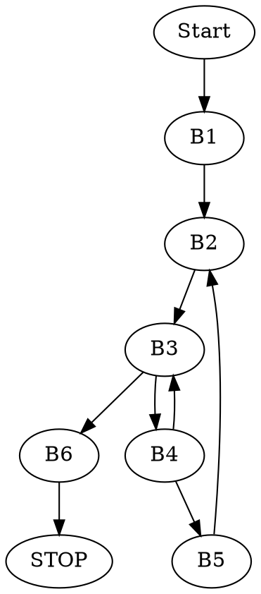

# Zadanie 2


Jest to procedura, znajdująca liczbę znaków, wspólnych dla napisów $s$ oraz $d$. Procedura działa, dopóki nie napotka pierwszego znaku, występującego w $s$, ale nie występującego w $d$. Wykorzystuje pętlę _while_.

Korzystając z _System V ABI_ wiemy, że argumenty $s$ oraz $d$ są zapisane odpowiednio w rejestrach `RDI` i `RSI`. Wynik jest zwracany przez `EAX`.

### Podział na bloki początkowe

```
puzzle2:
		movq %rdi, %rax	#<B1>
.L3: 		movb (%rax), %r9b	#<B2>
		leaq 1(%rax), %r8
		movq %rsi, %rdx
.L2: 		movb (%rdx), %cl	#<B3>
		incq %rdx
		testb %cl, %cl
		je .L4
		cmpb %cl, %r9b		#<B4>
		jne .L2
		movq %r8, %rax		#<B5>
		jmp .L3
.L4: 		subq %rdi, %rax	#<B6>
		ret
```

### Graf przepływu sterowania



### Kod w C

```c=
long puzzle(char* s, char* d)
{
    char* current_s = s;

    while(1)
    {
        char* current_d = d;
        while(*current_d == *current_s)
        {
            if(*current_d == NULL) return current_s - s;

            current_d++;
            break;
        }

        current_s++;
        }
    }
}
```
