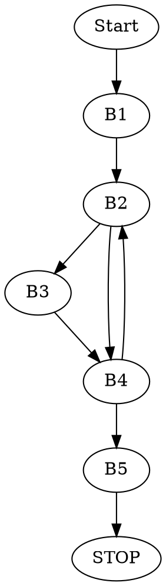

### 3.c

```c=
#include <stdio.h>

int main()
{
    printf("%u\n", puzzle3(12, 4));
    printf("%u\n", puzzle3(12, 3));
    printf("%u\n", puzzle3(8, 2));
    printf("%u\n", puzzle3(1, 2));
    printf("%u\n", puzzle3(4, 1));
    printf("%u\n", puzzle3(6, 5));

    return 0;
}
```

Uruchamiamy program poleceniem `$gcc 3.c 3.s && ./a.out`.

Uruchomienie programu i przetestowanie jego działania na kilku wybranych danych, pozwoliło ustalić, że procedura `puzzle3` oblicza wynik dzielenia całkowitego liczb `numerator` i `denominator`, zapisanych w rejestrach `EDI` i `ESI`.

### Procedura w C

```c=
uint32_t puzzle3(uint32_t n, uint32_t d)
{
    uint64_t numerator = n;                 // movl %edi, %edi
    uint64_t denominator = (uint64_t)d << 32;   // salq $32, %rsi
    uint32_t i = 32;               // movl $32, %edx
    uint32_t mask = 0x80000000;       // movl $0x80000000, %ecx
    uint32_t result = 0;             // xorl %eax, %eax

    for(i; i > 0; i--)
    {
        numerator += numerator;                  // addq %rdi, %rdi
        if(numerator >= denominator)
        {
            result = result | mask;
            numerator = numerator - denominator;
        }
        mask = mask >> 1;
    }

    return result;
}
```

### Podział na bloki podstawowe

```
.globl puzzle3

    .text
puzzle3:
    movl %edi, %edi          #<B1>
    salq $32, %rsi
    movl $32, %edx
    movl $0x80000000, %ecx
    xorl %eax, %eax
.L3: addq %rdi, %rdi         #<B2>
    movq %rdi, %r8
    subq %rsi, %r8
    js .L2
    orl %ecx, %eax          #<B3>
    movq %r8, %rdi
.L2: shrl %ecx              #<B4>
    decl %edx
    jne .L3
    ret                     #<B5>
```

### Graf przepływu sterowania


