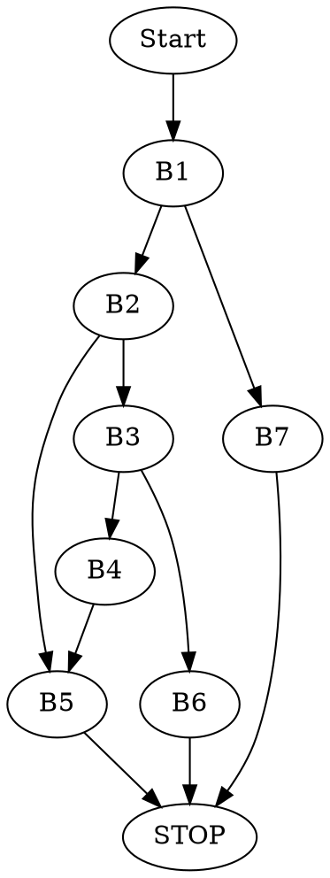

# Zadanie 4


Procedura implementuje rekurencyjny algorytm _binary search_.

Korzystając z _System V ABI_ wiemy, że:

- `a*` -- tablica w rejestrze `RDI`
- `v ` -- szukana wartość w rejestrze `RSI`
- `l ` -- początek podtablicy w rejestrze `RDX`
- `h ` -- koniec podtablicy w rejestrze `RCX`

```asm
puzzle4:	movq %rcx, %rax #kopiowanie h do RAX
		subq %rdx, %rax #obliczamy h-l
		shrq %rax       #(h-l) / 2, czyli wyznacenie środka podtablicy
		addq %rdx, %rax #mid = l + (h-l) / 2
		cmpq %rdx, %rcx #porównujemy l z h
		jb .L5 #jeśli l > h skaczemy do L5 (przeszliśmy juz całą tablicę)
		movq (%rdi,%rax,8), %r8 #przenosimy do r8 a[mid]
		cmpq %rsi, %r8 #porównujemy a[mid] z v
		je .L10 #skaczemy do L10, jeśli są równe
		cmpq %rsi, %r8 #porównujemy a[mid] z v
		jg .L11 # jeśli a[mid] > v skaczemy do L11 (ZF=0 i SF=OF)
		leaq 1(%rax), %rdx #w p.p. l = mid + 1 (szukamy w prawej podtablicy)
		call puzzle4 #wywołanie rekurencyjne na prawej podtablicy
.L10: 		ret #zwrócenie indeksu w przypadku znalezienia v lub zwrócenie wyniku wywołania z poprzedniej linii
.L11: 		leaq -1(%rax), %rcx #h = mid - 1 (szukamy w lewej podtablicy)
		call puzzle4 #wywołanie rekurencyjne na lewej podstablicy
		ret zwrócenie wyniku dla wywołania na lewej podtablicy
.L5: 		movl $-1, %eax #załadowania -1 jako wyniku
		ret #zwrócenie -1 w przypadku nieznalezienia v w całej tablicy
```

### Kod w C

```c=
int puzzle4(long *a, long v, uint64_t s, uint64_t e){
	uint64_t mid = s + (e - s)/2;
	if(s <= e){
		if(a[mid] == v) return mid;
		if(a[mid] > v) return puzzle4(a, v, s, mid-1)
		return puzzle4(a, v, mid+1, e);
	}
	return -1;
}
```

### Podział na bloki podstawowe

```
puzzle4:movq %rcx, %rax		        <B1>
		subq %rdx, %rax
		shrq %rax
		addq %rdx, %rax
		cmpq %rdx, %rcx
		jb .L5
		movq (%rdi,%rax,8), %r8 	<B2>
		cmpq %rsi, %r8
		je .L10
		cmpq %rsi, %r8			    <B3>
		jg .L11
		leaq 1(%rax), %rdx		    <B4>
		call puzzle4
.L10: 		ret				        <B5>
.L11: 		leaq -1(%rax), %rcx		<B6>
		call puzzle4
		ret
.L5: 		movl $-1, %eax			<B7>
		ret
```

### Graf przepływu sterowania


