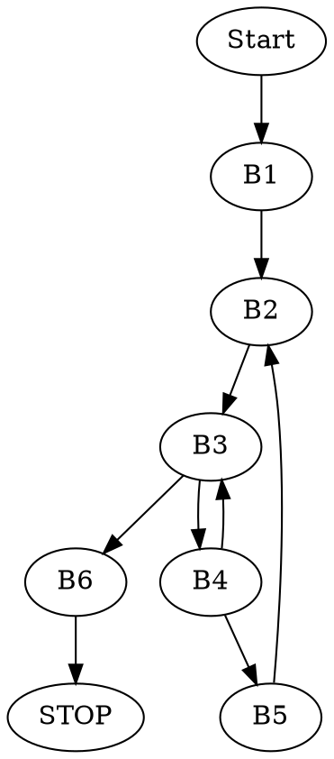
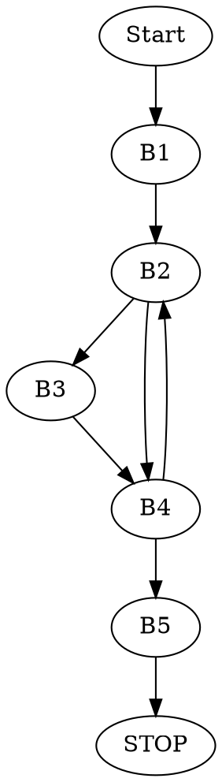
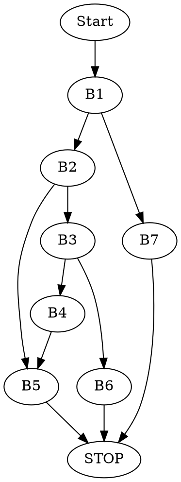

# ASK -- Lista 5


### Tablica opisująca użycie rejestrów

Źródło: https://raw.githubusercontent.com/wiki/hjl-tools/x86-psABI/x86-64-psABI-1.0.pdf

# Zadanie 1


Jest to procedura, która oblicza liczbę zapalonych bitów w liczbie $x$ o długości $n$ bitów. Wykorzystuje ona instrukcję pętli.

### Kod w C

```c=
int puzzle(long x, unsigned int n)
{
    int result = 0;

    for(unsigned int i = 0; i < n; i++)
    {
        result += x & 1;
        x = x >> 1;
    }

    return result;
}
```

# Zadanie 2


Jest to procedura, znajdująca liczbę znaków, wspólnych dla napisów $s$ oraz $d$. Procedura działa, dopóki nie napotka pierwszego znaku, występującego w $s$, ale nie występującego w $d$. Wykorzystuje pętlę _while_.

Korzystając z _System V ABI_ wiemy, że argumenty $s$ oraz $d$ są zapisane odpowiednio w rejestrach `RDI` i `RSI`. Wynik jest zwracany przez `EAX`.

### Podział na bloki początkowe

```
puzzle2:
		movq %rdi, %rax	#<B1>
.L3: 		movb (%rax), %r9b	#<B2>
		leaq 1(%rax), %r8
		movq %rsi, %rdx
.L2: 		movb (%rdx), %cl	#<B3>
		incq %rdx
		testb %cl, %cl
		je .L4
		cmpb %cl, %r9b		#<B4>
		jne .L2
		movq %r8, %rax		#<B5>
		jmp .L3
.L4: 		subq %rdi, %rax	#<B6>
		ret
```

### Graf przepływu sterowania



### Kod w C

```c=
long puzzle(char* s, char* d)
{
    char* current_s = s;

    while(1)
    {
        char* current_d = d;
        while(*current_d == *current_s)
        {
            if(*current_d == NULL) return current_s - s;

            current_d++;
            break;
        }

        current_s++;
        }
    }
}
```

# Zadanie 3


Korzystając z _System V ABI_ wiemy, że argumenty `numerator - n` oraz `denominator - d`są zapisane odpowiednio w rejestrach `EDI` i `ESI`. Wynik jest zwracany przez `EAX`.

Program napisany na podstawie ustępu _Mixing C and Assembly Language_.

## Pliki

### 3.s

```asm=
    .globl puzzle3

    .text
puzzle3:
    movl %edi, %edi #zeruje wyższe 32 bity liczby
    salq $32, %rsi #przesuwa mianownik na wyższe 32 bity
    movl $32, %edx #ustawienie wartości iteratora pętli i na 32
    movl $0x80000000, %ecx #najwyższy bit ustawiamy na 1, tworzymy maskę
    xorl %eax, %eax #EAX ustawiony na 0, przechowuje wynik
.L3: addq %rdi, %rdi #n+n = 2*n = n<<1
    movq %rdi, %r8 #zapisujemy wynik w r8
    subq %rsi, %r8 #n<<1 - d<<32
    js .L2 #jeśli odejmowanie dało liczbę ujemną (SF=1)
    orl %ecx, %eax #w p.p. ustawiamy 1 bit wyniku na 1
    movq %r8, %rdi #n = n<<1 - d<<32
.L2: shrl %ecx #przesuwamy bit maski o jedno miejsce w prawo
    decl %edx #dekrementacja iteratora, tj. i--
    jne .L3 #jeśli i!=0 wykonujemy kolejny obrót pętli
    ret #zwracamy result
```

### 3.c

```c=
int main()
{
    printf("%u\n", puzzle3(12, 4));
    printf("%u\n", puzzle3(12, 3));
    printf("%u\n", puzzle3(8, 2));
    printf("%u\n", puzzle3(1, 2));
    printf("%u\n", puzzle3(4, 1));
    printf("%u\n", puzzle3(6, 5));

    return 0;
}
```

Uruchamiamy program poleceniem `$gcc 3.c 3.s && ./a.out`.

Uruchomienie programu i przetestowanie jego działania na kilku wybranych danych, pozwoliło ustalić, że procedura `puzzle3` oblicza wynik dzielenia całkowitego liczb `numerator` i `denominator`, zapisanych w rejestrach `EDI` i `ESI`.

### Procedura w C

```c=
uint32_t puzzle3(uint32_t n, uint32_t d)
{
    uint64_t numerator = n;                 // movl %edi, %edi
    uint64_t denominator = (uint64_t)d << 32;   // salq $32, %rsi
    uint32_t i = 32;               // movl $32, %edx
    uint32_t mask = 0x80000000;       // movl $0x80000000, %ecx
    uint32_t result = 0;             // xorl %eax, %eax

    for(i; i > 0; i--)
    {
        numerator += numerator;                  // addq %rdi, %rdi
        if(numerator >= denominator)
        {
            result = result | mask;
            numerator = numerator - denominator;
        }
        mask = mask >> 1;
    }

    return result;
}
```

### Podział na bloki podstawowe

```
.globl puzzle3

    .text
puzzle3:
    movl %edi, %edi          #<B1>
    salq $32, %rsi
    movl $32, %edx
    movl $0x80000000, %ecx
    xorl %eax, %eax
.L3: addq %rdi, %rdi         #<B2>
    movq %rdi, %r8
    subq %rsi, %r8
    js .L2
    orl %ecx, %eax          #<B3>
    movq %r8, %rdi
.L2: shrl %ecx              #<B4>
    decl %edx
    jne .L3
    ret                     #<B5>
```

### Graf przepływu sterowania



# Zadanie 4


Procedura implementuje rekurencyjny algorytm _binary search_.

Korzystając z _System V ABI_ wiemy, że:

- `a*` -- tablica w rejestrze `RDI`
- `v ` -- szukana wartość w rejestrze `RSI`
- `l ` -- początek podtablicy w rejestrze `RDX`
- `h ` -- koniec podtablicy w rejestrze `RCX`

```asm
puzzle4:	movq %rcx, %rax #kopiowanie h do RAX
		subq %rdx, %rax #obliczamy h-l
		shrq %rax       #(h-l) / 2, czyli wyznacenie środka podtablicy
		addq %rdx, %rax #mid = l + (h-l) / 2
		cmpq %rdx, %rcx #porównujemy l z h
		jb .L5 #jeśli l > h skaczemy do L5 (przeszliśmy juz całą tablicę)
		movq (%rdi,%rax,8), %r8 #przenosimy do r8 a[mid]
		cmpq %rsi, %r8 #porównujemy a[mid] z v
		je .L10 #skaczemy do L10, jeśli są równe
		cmpq %rsi, %r8 #porównujemy a[mid] z v
		jg .L11 # jeśli a[mid] > v skaczemy do L11 (ZF=0 i SF=OF)
		leaq 1(%rax), %rdx #w p.p. l = mid + 1 (szukamy w prawej podtablicy)
		call puzzle4 #wywołanie rekurencyjne na prawej podtablicy
.L10: 		ret #zwrócenie indeksu w przypadku znalezienia v lub zwrócenie wyniku wywołania z poprzedniej linii
.L11: 		leaq -1(%rax), %rcx #h = mid - 1 (szukamy w lewej podtablicy)
		call puzzle4 #wywołanie rekurencyjne na lewej podstablicy
		ret zwrócenie wyniku dla wywołania na lewej podtablicy
.L5: 		movl $-1, %eax #załadowania -1 jako wyniku
		ret #zwrócenie -1 w przypadku nieznalezienia v w całej tablicy
```

### Kod w C

```c=
int puzzle4(long *a, long v, uint64_t s, uint64_t e){
	uint64_t mid = s + (e - s)/2;
	if(s <= e){
		if(a[mid] == v) return mid;
		if(a[mid] > v) return puzzle4(a, v, s, mid-1)
		return puzzle4(a, v, mid+1, e);
	}
	return -1;
}
```

### Podział na bloki podstawowe

```
puzzle4:movq %rcx, %rax		        <B1>
		subq %rdx, %rax
		shrq %rax
		addq %rdx, %rax
		cmpq %rdx, %rcx
		jb .L5
		movq (%rdi,%rax,8), %r8 	<B2>
		cmpq %rsi, %r8
		je .L10
		cmpq %rsi, %r8			    <B3>
		jg .L11
		leaq 1(%rax), %rdx		    <B4>
		call puzzle4
.L10: 		ret				        <B5>
.L11: 		leaq -1(%rax), %rcx		<B6>
		call puzzle4
		ret
.L5: 		movl $-1, %eax			<B7>
		ret
```

### Graf przepływu sterowania



# Zadanie 5


Korzystając z _System V ABI_ wiemy, że:

- `x` -- w rejestrze `RDI`
- `n` -- w rejestrze `RSI`
- `result` -- zwracany przez rejestr `RAX`

### Tablica skoków
|Adres w tablicy skoków|Adres etykiety|wartość `n`| etykieta|
|----------------------|--------------|-----------|---------|
|0x4006f8              |0x4005a1      |0          |L0       |
|0x400700              |0x4005a1      |1          |L0       |
|0x400708              |0x4005b2      |2          |L1       |
|0x400710              |0x4005c3      |3          |L2       |
|0x400718              |0x4005aa      |4          |L3       |
|0x400720              |0x4005bf      |5          |L4       |


Skoki w kodzie wykonywane są instrukcją `jmpq *0x4006f8(,%rsi,8)`. Początek tablicy skoków jest pod adresem `0x4006f8`. Instrukcja `ja   *0x4005c3 ` z czwartej linii kodu pozwala nam zauważyć, że etykieta dla `default` (dla wartości `n` niesprecyzowanych w tablicy skoków) znajduje się pod adresem `00x4005c` i jest to etykieta `L2`.

### Kod w asemblerze
```asm=
400590 <switch_prob>:
400590:		 ... subq $0x3c,%rsi            #n = n - 60
400594:		 ... cmpq $0x5, %rsi            #porównanie n z 5
400598:		 ... ja   *0x4005c3             #jeśli n > 5, to skacze do default
40059a: 	 ... jmpq *0x4006f8(,%rsi,8)    #w p.p. wyciągamy adres skoku spod adresu 0x4006f8 + n * 8 i skaczemy tam
4005a1:	L0	 ... lea 0x0(,%rdi,8),%rax      #result = x * 8 dla n = 0 lub 1
4005a9:		 ... retq		                #zwracamy result
4005aa:	L3	 ... movq %rdi,%rax             #ustawiamy result na x, jeśli n = 4
4005ad:		 ... sarq $0x3,%rax             #result = result>>3
4005b1:		 ... retq	                    #zwracamy result
4005b2:	L1	 ... movq %rdi,%rax             #result = x dla n = 2
4005b5:		 ... shlq $0x4,%rax             #result = result << 4
4005b9:		 ... subq %rdi,%rax 	        #result = result - x
4005bc:		 ... movq %rax,%rdi 	        #x = result (łącznie x = (x<<4) - x = 15 * x)
4005bf:	L4	 ... imulq %rdi,%rdi            #x = x * x, jeśli n = 5 lub spadliśmy z case'a dla n = 2. Młodsze bity x zapisane w RAX
4005c3:	L2	 ... leaq 0x4b(%rdi),%rax       #result = x + 75
4005c7:		 ... retq                       #zwracamy x
```

### Kod w C
```c=
long switch_prob(long x, long n)
{
    n -= 60;
    
    switch(n)
    {
        case 0: 
        case 1:
            return x * 8;
        case 4:
            return x >> 3;
        case 2:
            x *= 15;
        case 5:
            x *= x;   
        default:
            return x + 75;
    }
}
```