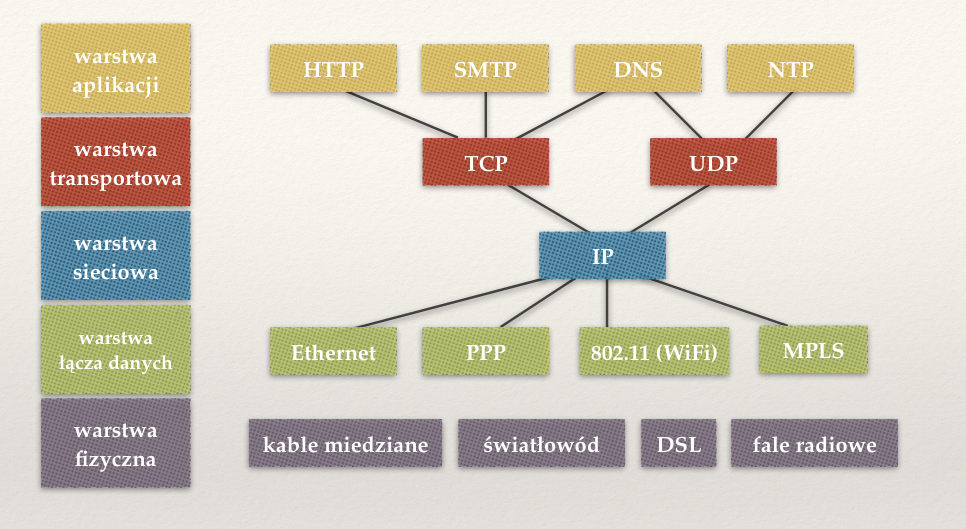
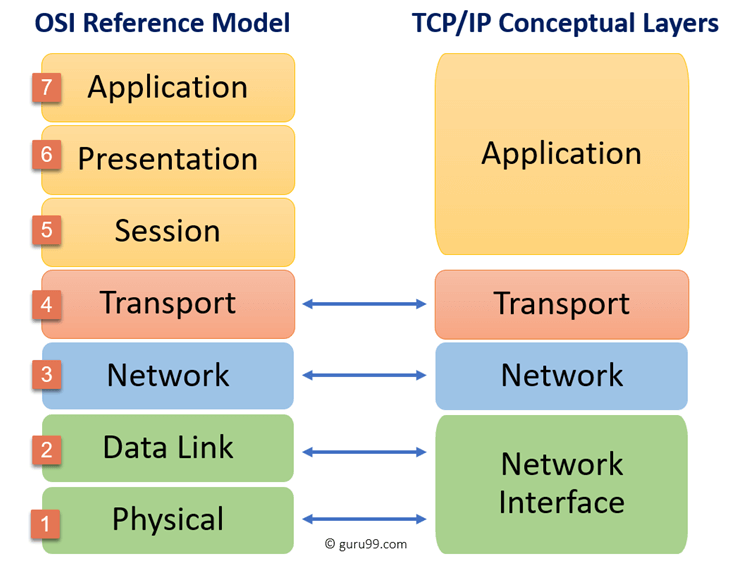
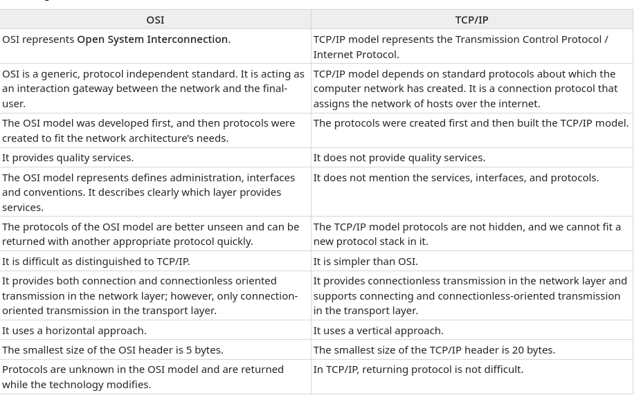
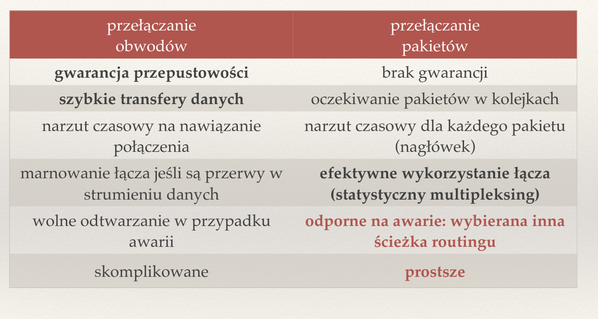
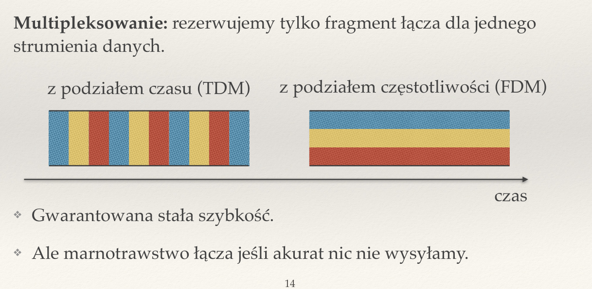
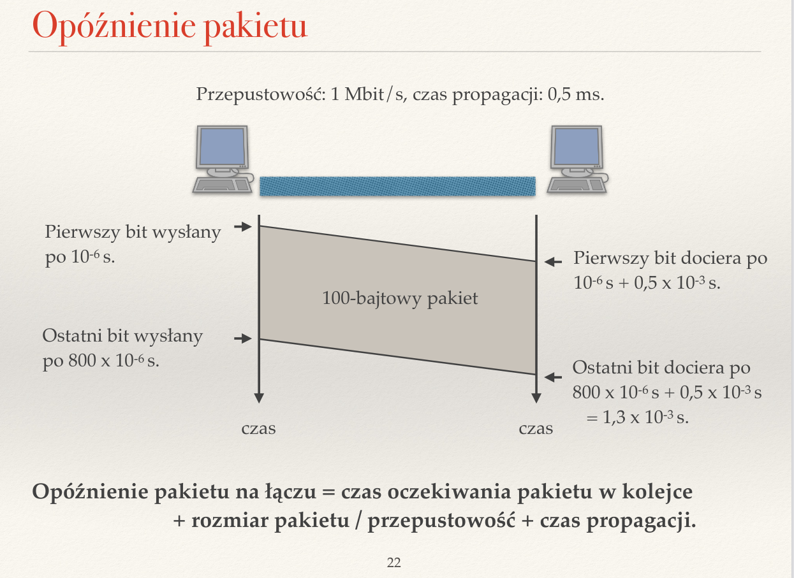

# Sieci Komputerowe -- Notatki
Created Tuesday 21 June 2022

[+Wykład 1 -- Wstęp](#Sieci Komputerowe -- Notatki:Wykład 1 -- Wstęp)
[+Wykład 2-- Routing (adresowanie)](#Sieci Komputerowe -- Notatki:Wykład 2-- Routing (adresowanie))

# Wykład 1 -- Wstęp
Zagadnienia
-----------

### ❖ Co to jest protokół komunikacyjny? Dlaczego wprowadza się warsty protokołów?
Zbiór reguł, określających w jaki sposób zachodzi komunikacja między urządzeniami — jej zasady, składnię, sposób synchronizaacji, wykrywania i korekcji błędów, itp. 

### ❖ Wymień warstwy internetowego modelu warstwowego. Jakie są zadania każdej z nich?
Komunikacja w Internecie dzieli się na kilka warstw, które wydzielają niezależne od siebie warstwy abstrakcji. Różne warstwy abstrakcji nie widzą się nawzajem, co zapewnia klarowność i upraszcza wymianę danych.  Można wyróżnić:

* **Warstwa aplikacji** — najwyższa warstwa abstrakcji, w której dwie aplikacje komputerowe komunikują się ze sobą, np. za pomocą adresów internetowych, nie zwracając uwagi na takie szczegóły, jak adres IP komputera, z którym się łączą. Przykładem protokołu z tej warstwy jest HTTP, który umożliwia transfer informacji, np. między witrynami internetowymi.
* **Warstwa** **transportowa** — leży poniżej warstwy aplikacji. Jej protokoły mają świadomość portów, z których korzystają dane aplikacje, więc wiedzą pod który z nich powinny wysyłać dane. Istnienie portów umożliwa komputerom rozróżnienie, do którego z uruchomionych procesów powinny przesłać otrzymane z sieci dane (każdy proces, np. przeglądarka internetowa, ma przypisany własny numer portu, a protokoły mają na stałe przypisany dany port, np. HTTP to 80, a SSH 22).
* **Warstwa** **sieciowa** — leży jeszcze niżej i obsługuje tylko jeden protokół — IP. Umożliwia rozróżnianie komputerów oraz sieci i wie, do którego urządzenia powinna przesłać dane, korzystając z adresów IP. Są to jednak adresy logiczne, pozwalające na **komunikację globalną** — warstwa sieciowa nie ma wglądu w faktyczną implementację kanału, jakim zachodzi komunikacja, tj. nie wie czy komputer łączy się ze światem za pomocą WIFI, czy przez Ethernet, nie interesuje jej też, przez jakie inne maszyny po drodze muszą przejść dane, by dotrzeć do celu.
* **Wartstwa łącza danych** — podobnie jak IP umożliwia komunikację między komputerami, ale na poziomie lokalnym, tj. między dwiema maszynami, które są ze sobą **połączone bezpośrednio***. *Posiada informację na temat tego, jakim kanałem odbywa się komunikacja, tj. rozumie w jaki sposób przesyłać dane przez Ethernet, a w jaki przez WIFI.
* **Fizyczna **— opisuje fizyczny sposób, w jaki odbywa się komunikacja, tj. przez kabel miedziany, światłowód czy przez fale radiowe.

Ze względu na to, że warstwa sieciowa obsługuje wyłącznie jeden protokół — IP, możliwa jest komunikacja dowolnych sieci (jej szczegóły są stalane przez pozostałe wastwy), a ponadto wszelkie modyfikacje protokołów komunikacji są implementowane na pozostałych warstwach — tych, których dotyczą. Jest to modularność, która pozwala na niezależny rozwój protokołów i komunikacji internetowej bez ingerencji w pozostałe warstwy.

### ❖ Jakie warstwy są zaimplementowane na komputerach a jakie na routerach?
Zastanówmy się, co jest w zasadzie potrzebne komputerowy do komunikacji? Na pewno chcielibyśmy korzystać, np. z przeglądarki internetowej, a do tego konieczna jest warstwa aplikacji. Podobnie do tego będzie nam potrzebna warstwa transportowa, ponieważ nie będzie to z pewnością jedyna aplikacja, którą będziemy się łączyć z internetem. By wysyłać pakiety pod odpowiednie adresy konieczne będzie użycie warstwy sieciowej oraz łącza danych, a także warstwy fizycznej, którą będzie implementować karta sieciowa, np. WIFI. W komputerze zaimplementowane są w takim razie wszystkie warstwy.

Kwestia routera jest bardziej skomplikowana. Teoretycznie ma on jedynie trasować ruch sieciowy, przekierowywać pakiety, do czego potrzebuje jedynie warstw od fizycznej do sieciowej, ale wyczytałem, że w praktyce implementuje wszystkie warstwy (<https://www.quora.com/Which-layers-are-present-in-a-router?share=1>). Jednak sądzę, że oczekiwaną odpowiedzią jest sieciowa, łącza danych i fizyczna.

### ❖ Czym różni się model warstwowy TCP/IP od OSI?

Oba modele dzielą komunikację sieciową na warstwy, którym przypisują określone funkcje, jednak różnią się poziomem szczegółowości. Model OSI wprowadza dodatkowe podwarstwy w warstwie aplikacji (aplikacji, prezentacji oraz sesji), a także w warstwie łącza danych (łącza danych i fizyczna). Model OSI wprowadza silne rozgraniczenie między interfejsami, usługami i protokołami, gdzie w TCP/IP te granice są bardziej rozmyte. 

### ❖ Co jest potrzebne do zbudowania dwukierunkowego niezawodnego kanału?

* adresowanie
* metoda przesyłu danych
* metoda zapewniania niezawodności przesyłu danych

Do tego musimy umożliwić przesył danych w dwa kierunki jednocześnie. Można to zrobić na dwa sposoby:

1. Fizyczny podział łącza na dwa kanały, np. dwa kable — jeden do wysyłania, a drugi do odbierania.
2. Podział kanału na sygnały, które mogą poruszać się w oba kierunki, np. podział danych na pakiety.

### ❖ Porównaj wady i zalety przełączania obwodów i przełączania pakietów.
**Przełączanie obwodów** polega na fizycznym lub wirtualnym zarezerwowaniu łącza dla danego użytkownika, co łączy się ze **stałą prędkością komunikacji i gwarancję przepustowości**, jednak pociaga za sobą znaczną wadę — **łącze jest** **marnowane**, gdy klient, który zarezerwował łącze, akurat nic nie wysyła. W praktyce jest to także rozwiazanie bardziej skomplikowane konstrukcyjnie.

Rozwiązaniem tego problemu jest zastosowanie **przełączania pakietów**, w którym każdy klient wysyła pojedyncze pakiety, na które podzielił wysyłane przez siebie dane. Pakiety zawierają informację o tym, do kogo należy je dostarczyć, więc jednocześnie może nadawać wiele maszyn. To rozwiązanie zapewnia znaczny wzrost elastyczności komunikacji, a także zapewnia **efektywne wykorzystanie łącza**. Jednocześnie pakiety są kolejkowane i nie ma żadnej gwarancji przepustowości — dany klient może bardzo długo oczekiwać, aż jego pakiety zostana przesłane do odbiorcy. Sama konstrukcja pakietów wiąże się także z narzutem czasowym — trzeba taki pakiet skonstruować, obudowując dane nagłówkami. Z drugiej strony konstrukcyjnie jest to rozwiązanie bardzo proste, a także odporne na awarie (przesyłanie opiera się na tablicach routingu, więc w wypadku awarii wystarczy zmienić ścieżkę na inną).

### ❖ Jakie znasz rodzaje multipleksowania? Po co i kiedy się je stosuje?
Mamy dwa podstawowe rodzaje multipleksowania:

* z podziałęm czasu — każdy klient ma przydzielony pewien czas, w którym może nadawać. Jest to rozwiązanie stosowane w starszych protokołach telekomunikacyjnych, np. 2G, gdzie do danej anteny łączyło się kilka telefonów i każdemu przydzielano ułamek czasu.
* z podziałem częstotliwości — każdy z klientów otrzymuje własne pasmo częstotliwości, w którym może nadawać. Jest to rozwiązanie spotykane w radiu oraz telewizji, gdzie każda stacja lub kanał telewizyjny posiada własną częstotlwiość.

### ❖ Porównaj ze sobą rodzaje routingu.
Routing (inaczej trasowanie) to sposób doboru trasy dla danego pakietu. Wyróżnia się kilka rodzajów routingu:

* **routing źródłowy **— nagłówek pakietu zawiera pełną trasę do celu. Jak łatwo się domyślić, nie jest to optymalne rozwiązanie dla długich tras.
* **routing z tablicą routingu **— router, czyli maszyna przekierowująca pakiety zgodnie ze zdefiniowaną w sobie tablicą routingu, przekierowuje pakiety do kolejnych maszyn/routerów. **Tablica routingu**, to zbiór reguł, które pozwalają dopasowywać adres docelowy do pewnego wzorca, któremu jest przepisany router, do którego należy przekierować dany pakiet.
* **routing z wirtualnym przełączaniem obwodów** — nadawca rozpoczyna komunikację od przesłania pakietów kontrolnych, czym ustanawia ścieżkę do celu i konfiguruje routery na trasie. Czasami rezerwuje sobie w ten sposób dany fragment łącza. Następnie rozpoczyna przesył pakietów przez ustaloną wcześniej trasę.

### ❖ Co to jest komunikacja pełnodupleksowa, półdupleksowa i simpleksowa?

* **full-duplex** — dane mogą być przesyłane w obie strony jednocześnie.
* **half-duplex **— dane mogą być wysyłane w obie strony, ale nie jednocześnie (tylko naprzemiennie).
* **simplex** — dane mogą być wysyłane tylko w jedną stronę.

### ❖ Do czego służy polecenie traceroute? Co pokazuje?
Słuzy do wyszukania trasy, jaką przebywają pakiety IP. Wylistowuje routery i maszyny, jakie mija po drodze pakiet.

### ❖ Po co stosuje się bufory w routerach? Co to jest przeciążenie?
Routery to maszyny, które na wejściu odbierają pakiety, a na wyjściu wysyłają w dalszą podróż. Są jednak w stanie pracować tylko z daną prędkością. Gdy prędkość, z jaką pakiety są wysyłane na wejście routera jest większa od prędkości, z jaką router jest w stanie je przesłać dalej, wtedy pakiety mogą nie zostać odebrane przez router i zgubione. Dlatego w routerach stosuje się **bufory**, które przechowują pakiety, które oczekują na wysłanie. **Przeciążenie** to zjawisko przepełnienia takiego bufora — pakiety są wtedy tracone.

### ❖ Jakie są przyczyny opóźnień pakietów?
Opóźnienia pakietów wynikają z trzech przyczyn:

* zanim pakiet zostanie wysłany, musi opuścić kolejkę, w której oczekiwał
* pakiet składa się z wielu bajtów, ale łącze posiada maksymalną liczbę bajtów, jakie jest w stanie przesłać w jednostce czasu
* sam przesył danych wiąże się z czasem propagacji, czyli czasem, w jakim sygnał przebywa drogę między dwiema maszynami.

### ❖ Co to jest BDP? Co to jest czas propagacji?
**Czas propagacji** to czas, jaki jest potrzebny sygnałowi, by przebyć drogę między dwoma końcami kanału, np. prędkość sygnału elektrycznego w kablu koncentrycznym, albo fali elektromagnetycznej w powietrzu.
**BDP **(*bandwidth-delay product*) to iloczyn przepustowości i **RTT **(*Round Trip Time*, czyli czas propagacji do odbiorcy i z powrotem do nadawcy), który mówi o tym, ile danych uda nam się przesłać, zanim dostaniemy odpowiedź od odbiorcy na pierwszy wysłany pakiet.

### ❖ Wyjaśnij pojęcia: komunikacja simpleksowa, półdupleksowa, pełnodupleksowa.
Chwila, czy tego już nie było?  [❖ Co to jest komunikacja pełnodupleksowa, półdupleksowa i simpleksowa?](#Sieci Komputerowe -- Notatki:Wykład 1 -- Wstęp)

### ❖ Co umożliwia protokół IP? Co to znaczy, że protokół realizuje zasadę best effort?
**IP ***(Internet Protocol) *umożliwia **zawodną i bezpołączeniową **komunikację między dwoma urządzeniami w sieci. 
**Zasada *best effort*** oznacza brak gwarancji na to, że pakiet zostanie dostarczony (mogą się gubić i docierać w złej kolejności), ale nie są gubione celowo. 

### ❖ Jakie są zalety i wady zasady end-to-end?
**End-to-end **to zasada, mówiąca że wszelkie modyfikacje działania sieci powinny zachodzić nie w jej centrum, ale w urządzeniach końcowych, np. na poszczególnych maszynach. Dotyczy to np. implementacji niezawodności przesyłu danych.

<https://cio-wiki.org/wiki/End-to-End_Principle#Pros_and_Cons_of_End-to-End-Principle.5B4.5D>

**Zalety**:

* elastyczność — zmiany są wprowadzane tam, gdzie są potrzebne, bez konieczności przebudowywania jądra sieci, co jest potencjalnie bardzo kosztowne
* prostota implementacji — ponownie, wynika z braku konieczności przebudowy całej struktury sieci
* niższa awaryjność — w przypadku awarii spowodowanej przez daną modyfikację, problemy dotyczą tylko niewielkiego zbioru maszyn, a nie całej sieci

**Wady**:

* **niższa** **efektywność** — nakłady czasowe na każdym z punktów końcowych
* **problemy z wprowadzaniem zmian globalnych** — nie wystarczy zmodyfikować tylko jądra sieci, ale trzeba to zrobić dla każdego z punktów końcowych

### ❖ Po co wprowadza się porty?
Na komputerach jednocześnie wiele procesów może łaczyć się z siecią i prowadzić przez nią wymianę danych. Pakiety internetowe z informację od adresie IP, pod jaki mają zostać dostarczone, jednak gdy jądro systemu je odbierze, potrzebuje dodatkowej informacji, by ustalić do jakiego procesu należy je przesłać. W tym celu stosuje się **porty**, które są przypisywane w unikatowy sposób procesom. 

### ❖ Wyjaśnij pojęcie enkapsulacji i dekapsulacji.
**Enkapsulacja** — obudowywanie danych dodatkowymi danymi, np. dodawanie nagłówka do pakietów internetowych, by zapewnić danemu interfejsowi tylko te dane, które są mu potrzebne — utworzyć warstwę abstrakcji.
**Dekapsulacja **— proces odwrotny do enkapsulacji, tj. wyłuskiwanie danych spod warstwy abstrakcji.

# Wykład 2-- Routing (adresowanie)
Created Tuesday 21 June 2022

Zagadnienia
-----------

### ❖ Z czego wynika hierarchia adresów IP? Jaki ma wpływ na konstrukcję tablic routingu?
**Hierarchizowanie adresów IP** wynika z potrzeby uproszczenia trasowania pakietów w ruchu sieciowym. Adresy IP są dzielone na dzielone na sieci, w których znajdują się adresy IP tylko z określonego przedziału. Dana sieć może zostać następnie podzielona na jeszcze mniejsza podsieci, zawierajace odpowiednio mniej adresów. Taki hierarchiczny podział pozwala routerom na przechowywanie mniejszych tablic routingu, ponieważ dany router nie musi pamiętać trasy do każdego adresu IP w jego sieci, ale wystarczy, by pamiętał drogę do routerów, które odpowiadają za jego podsieci. Może wysłać pakiet do jednego z nich, a ten będzie mógł przesłać pakiet odpowiednio dalej, w obrębie swojej mniejszej sieci.
/pasted_image.png) 

### ❖ Notacja CIDR.
**CIDR **(*Classless Inter-Domain Routing) *— opisuje zakres adresów IP o wspólnym prefiksie za pomocą pary (*pierwszy adres z zakresu, długość prefiksu*), np.
/pasted_image001.png)
### ❖ Co to jest adres rozgłoszeniowy?
**Adres rozgłoszeniowy** to specjalny adres w obrębie sieci (ostatni adres z sieci), który służy do rozsyłania pakietów do wszystkich innych adresów z danego zakresu, tj. jeśli pakiet zostanie wysłany pod **adres** **broadcast**, wtedy trafi do każdego innego adresu z sieci.

### ❖ Co to jest maska podsieci
**Maska podsieci** to długość prefiksu adresów z danego zakresu. Jest 32-bitową liczbą, która określa, ile bitów adresu IP opisuje adres sieci, a ile adres hosta.
/pasted_image002.png)
### ❖ Opisz sieci IP klasy A, B i C.
Ze względów historycznych wydziela się klasy adresów IP (obecnie raczej nie), opisujące różne zakresy adresów:

1. **Klasa A **— adresy rozpoczynające się od 0 o masce /8.
2. **Klasa B** — adresy rozpoczynające się od 10 o masce /16.
3. **Klasa C **— adresy rozpoczynające się od 110 o masce /24[.]()

<https://sieci.infopl.info/index.php/adresowanie/klasyip>
/pasted_image004.png)
/pasted_image003.png)
### ❖ Co to jest pętla lokalna (loopback)?
Jest to specjalna sieć 127.0.0.0/8, służąca do celów testowych. Połączenie się z dowolnym adresem z tej sieci sprawia, że łączymy się z lokalnym komputerem (z samym sobą).

### ❖ Do czego służy pole TTL w pakiecie IP? Do czego służy pole protokół?
**TTL **(*Time To Live*) — pole, określające jak długo (przez ile adresów pośrednich) ma żyć dany pakiet, zanim zostanie odrzucony.
**Protokół** to pole w nagłówku IP, które określa jakiego protokołu datagram jest przechowywany w danych pakietu, np. 1 - ICMP, 6 - TCP, 17 - UDP).
/pasted_image005.png)
### ❖ Jakie reguły zawierają tablice routingu?
Są to reguły dotyczące przypisywania adresów routerów, do których zostanie przekierowany pakiet, na podstawie prefiksu docelowego adresu IP.
/pasted_image006.png)
### ❖ Na czym polega reguła najdłuższego pasującego prefiksu?
W niektórych przypadkach adres moze dopasować się do kilku różnych reguł (prefiksów). W tym wypadku wybierany jest najdłuższy prefiks, czyli najbardziej szczegółowa reguła.
/pasted_image007.png)
### ❖ Co to jest trasa domyślna?
Jest to trasa, którą router przypisuje pakietom, których adres docelowy nie dopasował się do żadnej reguły w jego tablicy routingu. Można powiedzieć, że to najbardziej ogólna reguła, do której dopasowuje się każdy adres, tj. 0.0.0.0/0.

### ❖ Do czego służy protokół ICMP? Jakie znasz typy komunikatów ICMP?
Protokół **ICMP **(*Internet Control Message Protocol *— protokół, odpowiadający za wsparcie diagnostyczne w urządzeniach sieciowych. Za jego pomocą wysyłane są informacje o błędach, niepowodzeniach i sukcesach w komunikacji, itd. Jest to protokół o tyle nietypowy, że nie jest stosowany do przesyłu danych. Obsługuje kilkadziesiąt typów wiadomości kontrolnych, którym przypisuje odpowiedni kod numeryczny, np.

* 0 — Echo Reply
* 3 — Destination Unreachable
* 5 — Redirect Message
* 8 - Echo Request
* 10 — Router Solicitation
* 11 — Time Exceeded

Korzystają z niego między innymi polecenia *ping* oraz *traceroute*.

### ❖ Jak działa polecenie ping?
Polecenie **ping** działa w sposób podobny do sonara — wysyła pakiet **ICMP Echo Request **do odbiorcy i czeka, aż otrzyma w odpowiedzi pakiet **ICMP Echo Reply**. Zwraca informację o **round trip time** ([❖ Co to jest BDP? Co to jest czas propagacji?](#Sieci Komputerowe -- Notatki:Wykład 1 -- Wstęp)), utraconych pakietach i pe informacje statystyczne.
ne.

### ❖ Jak działa polecenie traceroute
Polecenie t**raceroute** wykorzystuje wartość **TTL** pakietu ([❖ Do czego służy pole TTL w pakiecie IP? Do czego służy pole protokół?](#Sieci Komputerowe -- Notatki:Wykład 2-- Routing (adresowanie))) do badania trasy, jaką przebywają pakiety między dwoma urządzeniami końcowymi. Zaczyna od wysłania pakietu **ICMP Echo Request** do adresu docelowego z TTL=1. Po dotarciu do sąsiedniego routera jego TTL zostanie zmniejszony o 1 i spadnie do 0, a router odeśle nadawcy wiadomość **ICMP Time Exceeded**. Nadawca zapamięta adres IP routera, który wysłał mu informację o niepowodzeniu i spróbuje wysłać **ICMP Echo Request** z TTL=2. Będzie powtarzał tę sekwencję do momentu, aż dotrze do adresu docelowego i otrzyma od niego pakiet **ICMP Echo Reply**. Wtedy pamięta już listę wszystkich routerów, jaki minął na trasie między tymi dwiema maszynami.

### ❖ Dlaczego do tworzenia gniazd surowych wymagane są uprawnienia administratora?
Gniazda surowe umożliwiają użytkownikowi wysłanie i odbieranie dowolnych pakietów, co może stanowić poważne zagrożenie dla bezpieczeństwa. Surowe gniazda nie znają pojęcia **portu**, więc mogą odbierać wszystkie pakiety, jakie przychodzą do komputera, nawet te, które przychodzą do innych użytkowników.

<https://squidarth.com/networking/systems/rc/2018/05/28/using-raw-sockets.html>

### ❖ Co to jest sieciowa kolejność bajtów?

W sieci korzysta się z innej notacji liczbowej niz w popularnych architekturach komputerowych (**big endian** zamiast **little endian**). Notację **big endian** nazywamy **sieciową kolejnością bajtów  **— od lewej piszemy najstarsze bajty.

### ❖ Co robią funkcje socket(), recvfrom() i sendto()?
**socket()** — tworzy punkt końcowy w komunikacji, tj. miejsce, z którym może się łączyć inna maszyna, by skomunikować się z naszym komputerem, a następnie zwraca deskryptor pliku, który odnosi się do tego punktu końcowego.
**recvfrom()** — odbiera wiadomość z danego gniazda, czytając z deskryptora pliku. Bardzo przypomina **read()**, z tą różnicą, że przyjmuje jago argument **flagi**. Odczytane dane zapisuje do wskazanego bufora. Zwraca liczbę odebranych bajtów.
**sendto()** — wysyła przekazaną w argumencie wiadomość do danego gniazda, a następnie zwraca liczbę przesłanych bajtów.

### ❖ Jaki informacje zawiera struktura adresowa sockaddr_in?

``struct sockaddr_in {``
``   short int            sin_family;``
``   unsigned short int   sin_port;``
``   struct in_addr       sin_addr;``
``   unsigned char        sin_zero[8];``
``};``

/pasted_image009.png)

### ❖ Co to jest tryb blokujący i nieblokujący? Co to jest aktywne czekanie?
**Tryb blokujący i nieblokujący **— różne metody obsługi I/O. W trybie blokującym dane są odczytywane tylko wtedy, gdy faktycznie jest coś do odczytania, np. w przypadku odczytu z pustego gniazda serwer będzie czekał i nie robił nic innego poza tym, dopóki w gnieździe nie pojawią się dane do odczytu. W przypadku trybu nieblokującego jest inaczej — operacja odczytu i zapisu jest wykonywana natychmiastowo. Jeśli spróbujemy odczytać coś z pustego gniazda otrzymamy kod błędu EAGAIN albo EWOULDBLOCK. W przypadku trybu nieblokującego system operacyjny nie sprawdzi za nas, kiedy będziemy mieli co odczytać z gniazda i musimy sprawdzać to sami. Najprostszy sposób to **aktywne czekanie**, jednak ta opcja wiąże się z marnowaniem czasu procesora. Dużo lepszym wyborem jest użycie funkcji **select() **lub **poll()**.
**Aktywne czekanie **— nieustanne sprawdzanie, czy nie nastąpiły jakieś zmiany w stanie systemu. Jest to najczęściej niepożądane zachowanie, ponieważ prowadzi do marnowania mocy obliczeniowej procesora na robienie niczego — czekanie.

### ❖ Jakie jest działanie funkcji select()?

**select()** pozwala programowi na monitorowanie stanu deskryptorów plików. Informuje ona program, że deskryptor jest gotowy do wykonania na nim operacji I/O, a sam program może w tym czasie wykonywać inne zadania, unikając w ten sposób aktywnego czekania. Użytkownik ustala maksymalny czas, przez jaki select() będzie czekał na zmianę stanu deskryptora (timeout).

# Wykład 3 -- Routing (tworzenie tablic)
Created Tuesday 21 June 2022

Zagadnienia
-----------

#### ❖ Co to jest cykl w routingu? Co go powoduje?
Cykl w routingu to sytuacja, w którym ten sam pakiet dotrze do routera, przez który został wysłany. Jest to niekorzystny scenariusz, ponieważ pakiety zamiast dotrzeć do celu, zaczynają krążyć w kółḱo.  Może on wystapić np. w przypadku awarii łącza, lub gdy tablica routingu zostanie źle skonfigurowana.
/pasted_image.png)
#### ❖ Czym różni się tablica routingu od tablicy przekazywania?
**Tablica przekazywania **(*forwarding table*) to silnie zoptymalizowana struktura danych, zawierająca informacje o następnym routerze na trasie. Często jej implementacja jest wspierana sprzętowo. Służy do podejmowania decyzji o przesłaniu pakietu na podstawie najdłuższego pasującego prefiksu adresu. Jest to znacznie większa struktura, przechowująca liczne informacje o topologii sieci.

**Tablica routingu** (*routing table*) to tablica, zawierająca informacje o trasach, jakie pokonują pakiety, w tym trasach zapasowych. Jest to w pewnym sensie podzbiór tablicy przekazywania.

#### ❖ Dlaczego w algorytmach routingu dynamicznego obliczamy najkrótsze ścieżki?
Ponieważ chcemy, by wyznaczone trasy były minimalne pod względem kosztu. Koszt danego połączenia definiuje metryka, bezpośrednio określająca to, co nazywamy *najkrótszą ścieżką*.

#### ❖ Co to jest metryka? Jakie metryki mają sens?
Metryka to metoda opisu odległości, lub bardziej ogólnie kosztu danej trasy. Metryką może być fizyczna odległość w metrach, czas propagacji sygnału, koszt wysłania pakietu między urządzeniami, itd.

#### ❖ Czym różnią się algorytmy wektora odległości od algorytmów stanów łączy?
**Wektor odległości** — jest to pewna implementacja algorytmu Bellmana-Forda. Routery **wysyłają do sąsiadów** swoje **tablice przekazywania** co określony interwał czasowy, np. 30 sekund. Każdy z nich na podstawie otrzymanych tablic ustala najkrótszą trasę do punktu docelowego. Cechuje się trzema własnościami:

* każdy router rozsyła to, co wie o **całej sieci**
* informacje są rozsyłane **jedynie do sąsiadów**,
* informacje są rozsyłane w **regularnych odstępach czasowych**.

**Stan łącza **— każdy router rozsyła wiadomość jedynie o swoim **bezpośrednim sąsiedztwie**, ale do **wszystkich pozostałych routerów**. Taki mechanizm rozsyłania informacji nazywamy **zalewaniem **(*flooding*) — każdy router otrzymuje pakiet i rozsyła jego kopie do sąsiadów. Wiadomości nie są wysyłane regularnie, a jedynie wtedy, gdy zajdzie jakaś zmiana w stanie danego routera. Ostatecznie wiadomość rozlewa się po całej sieci. Na podstawie otrzymanych informacji routery obliczają lokalnie optymalne trasy do wszystkich innych routerów (np. za pomocą algorytmu Dijkstry). Finalnym stanem algorytmu jest znajomość **całej sieci** przez każdy router. Podsumowując:

* każdy router rozsyła do wszystkich innych routerów (poza sąsiadami) wiadomości o **odległości do swoich sąsiadów**
* wiadomości są wysyłane tylko wtedy, gdy nastąpi **zmiana w sieci**
* każdy router rozsyła jedynie wiadomości o **swoich sąsiadach**
* finalnie każdy router zna **topologię całej sieci**

#### ❖ Jak router może stwierdzić, że sąsiadujący z nim router jest nieosiągalny?
Wystarczy ustalić graniczną wartość odległości, powyżej której router jest uważany za nieosiągalny (pomaga rozwiązać problem zliczania do nieskończoności).

#### ❖ Co to znaczy, że stan tablic routingu jest stabilny?
Oznacza, że wysłanie kolejnych wektorów odległości nie powoduje aktualizacji tablic przekazywania.

#### ❖ Jak zalewać sieć informacją? Co to są komunikaty LSA?
**Komunikaty LSA **(I*Link State Advertisement*) — określają stan pojedynczego łącza. Zawierają źródło komunikatu oraz numer sekwencyjny (jako który z kolei pakiet zostały wysłane). Są przesyłane na początku, przy każdej zmianie oraz co ustalony czas, np. 30 minut. Wykorzystywany prez protokół **OSPF** (Open Shortest Path First). Rozsyłane przy **kontrolowanym zalewaniu**.

**Kontrolowane/Niekontrolowane zalewanie **— metoda, z jaką rozsyłamy informacje o sieci innym routerom. W przypadku niekontrolowanego zalewania informacje są wysyłane do każdego, a routery nie sprawdzają w żaden sposób, czy już kiedyś przekazaly daną informację. Może to prowadzić do wielokrotnego wysyłania tych samych wiadomości i zbędnego obciążania sieci. By temu zaradzić do wiadomości dodaje się pewne metadane, które pozwalają routerom odróżniać od siebie wiadomości, np. dołączając do nich numery sekwencyjne i adresy routera źródłowego. Takie rozwiązanie to kontrolowane zalewanie.

#### ❖ Co wchodzi w skład wektora odległości?
**Wektor odległości** zawiera jedynie informacje do znanych mu routerów oraz sieci.

#### ❖ W jaki sposób podczas działania algorytmu routingu dynamicznego może powstać cykl w routingu?
Rozważmy przypadek awarii łącza między routerami C i D. Wszystko będzie w porządku, jeśli routery przekażą sobie swoje tablice w odpowiedniej kolejności. Nie mamy jednak gwarancji, że się tak stanie, np.
C dowiaduje się o tym natychmiast (czas = 1), ustala odległość do D na nieskończoność i rozsyła wiadomość do sąsiadów.
B dowiaduje się od C, że nie umie się już dostać do D i ustawia odległość na nieskończoność.
A dowiaduje się od B i ustawia odległość do D na nieskończoność.
Wszystko śmiga!

A co, jeśli B przekaże swoją tablicę do C, zanim C przekaże informację o awarii do B?
C dowiaduje się o awarii i ustawia odległość do D na nieskończoność.
B wysyła swoją tablicę do C.
C widzi, że samo nie umie się dostać do D, ale B powiedziało mu, że potrafi się dostać do D. Dlatego C aktualizuje swój wpis, przekierowując ruch do D przez B.
Powstał cykl w routingu. B i C będą wzajemnie wymuszać na sobie aktualizację, przez co ich odległości do D będą stale rosły (zliczanie do nieskończoności).
Problem wynikł stąd, że B wysłało wiadomość o trasie do D do C, ale C leży dokładnie na tej trasie.

/pasted_image001.png)

#### ❖ Co to jest problem zliczania do nieskończoności? Kiedy występuje?
Jak w wyżej opisanym przypadku, zliczanie do nieskończoności pojawia się wtedy, gdy router A wysyła swoją trasę do routera B, ale router B leży na tej wysłanej trasie. Prowadzi to do zapętlenia aktualizacji, przez co odleglości w tych dwóch routerach stale rosną do nieskończoności.

#### ❖ Na czym polega technika zatruwania ścieżki zwrotnej (poison reverse)?
Technika **zatruwania ścieżki zwrotnej** (*poison reverse*) w skrócie oznacza, że routery leżące bliżej na trasie do routera X wiedzą więcej o tej trasie, niż routery umieszczone dalej.  Np. w tej sytuacji router C ma lepszą wiedzę o stanie trasy do D niż router B:
/pasted_image002.png)

W praktyce mechanizm działa w taki sposób, że jeśli router X jest wpisany jako następny router na ścieżce do Y, to mówimy routerowi X, że mamy do Y ścieżkę nieskończoną. Korzystając z powyzszego rysunku. Jeśli B zechce powiedzieć C, że zna trasę do D długości n, wtedy zauważy, że C leży na tej trasie i finalnie powie, że nie umie dostać się do D. 

Technika ta pozwala uniknąć problemu zliczania do nieskończoności.

#### ❖ Po co w algorytmach wektora odległości definiuje się największą odległość w sieci (16 w protokole RIPv1)?
By uniknąć zliczania do nieskończoności. Jeśli trasa do routera będzie zbyt długa, uznajemy go za nieosiągalny.

#### ❖ Po co stosuje się przyspieszone uaktualnienia?
**Przyspieszone uaktualnienia** stosuje się w przypadku wykrycia awarii, jako pewna metoda radzenia sobie z problemem zliczania do nieskończoności.

#### ❖ Co to jest system autonomiczny (AS)? Jakie znasz typy AS?
**AS** (*Autonomous System*) to zbiór sieci lub grup sieci, które posiadają wspólną politykę routingu (często OSPF, raczej RIP). Systemy autonomiczne należą do dostawców Internetu (**ISP **— *Internet Service Provider*). Każdy ISP ma pod sobą co najmniej jeden system autonomiczny.
/pasted_image003.png)

Systemy autonomiczne dzielą się na cztery typy względem ich polityki łączności i działania:

* **multihomed **— AS posiada połączenia do więcej niż jednego innego AS. Pozwala mu to na połączenie z Internetem nawet w razie kompletnej utraty łączoności z jednym z tych systemów. Różni się od **transit** tym, że nie przepuszcza przez siebie ruchu między dwoma innymi systemami — nie jest pośrednikiem.
* **stub **— AS, który łączy się tylko z jednym inny AS, ale pozwala na łącza partnerskie (**peering**) z wieloma innymi AS.
* **transit** — działa jak **multihomed**, ale pozwala na ruch tranzytowy.
* **IX/IXP **(*Internet Exchange Point*) — fizyczna struktura, za pomocą której **ISP **lub **CDN **(*Content Delivery Network*) wymieniają ruch internetowy między swoimi systemami autonomicznymi.

/pasted_image004.png)

#### ❖ Czym różnią się połączenia dostawca-klient pomiędzy systemami autonomicznymi od łącz partnerskich (peering)?
**Połączenia dostawca-klient (client-server)**:

* potrzebny jest centralny serwer, który obsługuje zapytania, by zapewnić stałość usługi
* przy dużym obciążeniu spada wydajność łącza, by temu zapobiec należy dodać wydajniejszy serwer
* skupia się na dostawie usługi i wymianie danych
* drogie w implementacji
* większe bezpieczeństwo, bo dostęp do zasobów jest kontrolowany przez serwer, a nie klientów
* może być używana zarówno dla małych, jak i dużych sieci (ograniczeniem jest wydajność serwera)

**Połączenia partnerskie (peer-to-peer)**

* skupia się na komunikacji i lączności
* szyscy uczestnicy połączenia (**peers**) działáją zarówno jako klient jak i serwer (odbiorca i dostawca)
* jest tańszy w implementacji, nie trzeba centralnej maszyny
* bezpieczeństwo zapewniane przez użytkowników — możliwa podatność na ataki
* stabilność łącza maleje, gdy śnie liczba uczestników
* zwykle wykorzystywana dla małych sieci

#### ❖ Dlaczego w routingu pomiędzy systemami autonomicznymi nie stosuje się najkrótszych ścieżek?
Ze względu na nieco inne priorytety dostawcy. Dostawca Internetu nie skupia się na szybkości, ale na minimalizacji kosztów (chce płacić jak najmniej), prywatności (nie chce udostępniać wewnętrznych informacji na temat systemu) oraz autonomii (nie chce, by ktoś wysyłał dane przez jego AS, ale on sam nie miał z tego korzyści).

#### ❖ Które trasy w BGP warto rozgłaszać i komu? A które wybierać?
**BGP **(*Border Gateway Protocol*) — protokół, który pozwala na routing danych w internecie.

Algorytmy routingu bazują na algorytmach wektora odległości (algorytmy stanu łączy nie gwarantują prywatności i wymagają uzgodnień między dostawcami Internetu). 
Rozgłaszane są całe poznane trasy, co pozwala na łatwe unikanie cykli.

Dostawca Internetu sam decyduje czy i komu rozgłosi trasę, a także które trasy wykorzysta do tworzenia tablic przekazywania.

**Które trasy warto rozgłaszać**:

* zawartość naszego AS (prefiksy CIDR), bo inaczej nikt nie trafi do naszej sieci
* trasy do naszych klientów, bo przecież to oni płącą za przekazywane dane, a w szczególności warto je rozgłaszać naszym partnerom (peers), bo za te połączenia nic nie płacimy
* trasy do naszych dostawców, ale wysyłamy je tylko naszym klientom — nie chcemy, żeby ktoś spoza naszego AS potrafił przesyłać przez nasz system dane do naszego dostawcy (my płacimy, a oni nie)
* trasy do naszych partnerów, ale ponownie — tylko klientom

**Jak dobierać trasy:**

* zwykle najkrótsza (najmniej AS po drodze)
* ale czasami zmieniamy ten wybór, bardzo często wysyłamy przez klienta -> partnera -> dostawcę.

#### ❖ Jak BGP współpracuje z algorytmami routingu wewnątrz AS?
Wykorzystuje routery brzegowe danego AS, tj. rozgłasza prefiksy CIDR tego AS, a następnie dowiaduje się o trasach do innych AS.

Dla AS z jednym wyjściem X ustala **routing wewnątrz AS** (OSPF lub RIP, IS-IS, itd.), a następnie dodaje X na wszystkich routerach jako bramę domyślną.

Jeśli AS posiada wiele wyjść X~1~, X~2~, ..., wtedy routery X~i~ biorą udział w protokole routingu wewnątrz AS, udostępniając w nim trasy, któ©ych nauczyły się przez BGP, jako swoje sąsiedztwo. Każdy router musi przechować dane o wielu sieciach.
/pasted_image006.png)

# Wykład 4 -- Routing (wewnątrz routera)
Created Tuesday 21 June 2022

Zagadnienia
-----------

### ❖ Co to są prywatne adresy IP? Jakie pule adresów są zarezerwowane na takie adresy?
Są to adresy przeznaczone dla sieci lokalnych. Pakiety o takich adresach nie są przekazywane przez routery, a same adresy mogą powtarzać się między wieloma sieciami. Ich pule to:

* 10.0.0.0/8 (jedna sieć klasy A)
* 172.16.0.0/12 (16 sieci klasy B)
* 192.168.0.0/16 (256 sieci klasy C)

### ❖ Co robi funkcja bind()?
**man** mówi, że *przypisuje nazwę do gniazda*, ale nie jest to zbyt wymowna definicja. W przypisaniu nazwy chodzi tak naprawdę o przypisanie adresu sieciowego do danego gniazda. Przypisany adres może pochodzić z różnych rodzin adresów, np. AF_INET (IP), AF_INET6 (ipv6), itd. Przypisany adres jest zapisywany w strukturze **sockaddr**.

### ❖ Czym różnią się porty o numerach mniejszych niż 1024 od innych?
Do wiązania z takim portem za pomocą funkcji **bind() **potrzebne są uprawnienia administratora. Wynika to z faktu, że są to tak zwane **well-known ports **(*dobrze znane porty*), które są zarezerwowane do użytku przez system operacyjny i kluczowe usługi. Udostępnienie ich normalnym użytkownikom byłoby naruszeniem bezpieczeństwa.

### ❖ Jakie są zadania procesora routingu, portu wejściowego, portu wyjściowego i struktury przełączającej? (może nie być dobrze)
Router składa się następujących części:

* **Procesor routingu **— otrzymuje niektóre pakiety (RIP, OSPF). Tworzy tablice przekazywania i wysyła je do portów wejściowych.
* **Port wejściowy **— odbiera pakiet, uaktualnia nagłówki IP (TTL i checksum), sprawdza do którego portu wyjściowego da się go przesłać.
* **Port wyjściowy **— przesyła pakiety dalej w świat. Jeśli pakiety są zbyt duże (większe niż **MTU **— *maximum transmission unit*), dzieli je na fragmenty. Szereguje pakiety w buforze wyjściowym, np. względem priorytetów lub cyklicznie (round-robin).
* **Struktura przełączająca **--przekazuje pakiety dalej z zadaną (lub przybliżoną) prędkością łącza. Przypomina strukturą sieci Benesa (z AiSDu).

/pasted_image.png)

### ❖ Czym się różni przełączanie pakietów w routerze za pomocą RAM od przełączania za pomocą struktury przełączającej?
We wczesnych generacjach routerów stosowano RAM zamiast struktury przełączającej. Było to  rozwiązanie proste i powolne, oparte na przerwaniach. Struktury przełączające pozwalają na przekazywanie pakietów z prędkością zbliżoną drękości łącza, np. dla N portów wejściowych o prędkości R chcemy przepustowość N*R. 

**Działanie:**

1. Port wejściowy odbiera pakiet i zgłasza przerwanie.
2. Procesor kopiuje pakiet do RAMu.
3. Wolny port wyjściowy zgłasza przerwanie.
4. Procesor kopiuje pakiet z RAMu.

### ❖ Jakie są pożądane cechy struktury przełączającej w routerze?

By przekazywała pakiety z prędkością łącza lub zbliżoną (N portów wejściowych o prędkości R to przepustowość N*R). Chcemy też, by potrafiła bezkolizyjnie i szybko przesłać dowolną permutację.

/pasted_image001.png)

### ❖ Gdzie w routerze stosuje się buforowanie? Po co?

Przy **portach wyjściowych**, gdzie zapobiegają utraci pakietów, przy czasowym zwiększeniu liczby pakietów do wysyłki.
Przy **portach wejściowych**, gdzie pomagają, gdy przepustowość struktury przełączającej jest zbyt niska, pakiety skierowane do zajętych łącz wyjściowych są blokowane. Pojawia się w nich jednak problem blokowania przodu kolejki:
/pasted_image002.png)

### ❖ Po co w portach wyjściowych klasyfikuje się pakiety?
By zapewnić sprawiedliwy przesył pakietów danego typu. Pakiety dzieli się na strumienie, bazując na określonej metodzie, np. przypisując im priorytety lub stosując round-robin.

/pasted_image004.png)
/pasted_image003.png)

### ❖ Co to jest blokowanie początku kolejki? Gdzie występuje? Jak się go rozwiązuje?
/pasted_image006.png)

### ❖ Rozwiń skrót LPM.
**LPM **— Longest Prefix Match. Mechanizm dopasowywania pakietów do portów zgodnie z adresem (prefiks CIDR).
/pasted_image008.png)

### ❖ Jakie znasz struktury danych implementujące LPM? Porównaj je.

1. **Lista prefiksów**
	1. pamięć: O(n)
	2. lookup: O(n)
	3. insert: O(1)
	4. delete: O(n)
2. **Tablice haszujące**
	1. w+1 tablic (dla każdej długości prefiksów) — w czasach klas adresów IP wystarczało 5 tablic
	2. pamięć: O(n)
	3. lookup: O(w) (oczekiwany)
	4. insert, delete: O(1) (oczekiwany)
3. **Drzewa trie**
	1. nowe systemy uniksowe, routery sprzętowe
	2. pamięć: O(n*w) — kompresja ścieżek bez rozgałęzień daje O(n)
	3. lookup: O(w)
	4. insert, delete: O(w)

/pasted_image010.png)

5. **Trie z krawędziamy skracającymi**
	1. lookup: O(log w)
	2. insert, delete: O(n) w najgorszym przypadku
	3. problem otwarty — czy wszystkie operacje można wykonać w O(log w)?
6. **Rozwiązania sprzętowe oparte o TCAM (nowsze routery sprzętowe)**
	1. **TCAM — ***ternary content addressable memory*
	2. przechowujemy pary (prefix, maska)
	3. dla adresu w można **równolegle **znaleźć wszystkie takie pary, że w&m = p&m (bitowy and), czyli wszystkie pasujące prefiksy
	4. sprzętowo wybieramy najdłuższy z nich

### ❖ Co to jest pamięć TCAM? Jak można ją zastosować do implementacji LPM?
**TCAM — ***ternary content addressable memory*. Rodzaj pamięci wysokiej prędkości, która przeszukuje całą swoją zawartość w jednym cyklu procesora. *Ternary *w nazwie bierze się stąd, że mamy trzy wartości logiczne — 1, 0 oraz X (don't care). Jest przeciwieństwem pamięci RAM, bo tam gdzie RAM potrzebuje adresu, by znaleźć zawartość, tam CAM potrafi wyszukiwać po zawartości.

Pamięć tę można wykorzystać do implementacji **LPM**, tworząc w niej pary (prefix, maska), a następnie możemy równolegle odnajdywać w niej wszystkie pary takie, że sieć & maska = prefix & maska, co daje nam wszystkie pasujące prefiksy. Wystarczy wtedy wybrać najdłuższy z nich.

### ❖ Na czym polega fragmentacja IP? Gdzie się ją stosuje i dlaczego? Gdzie łączy się fragmenty?

### ❖ Co to jest MTU? Na czym polega technika wykrywania wartości MTU dla ścieżki?

### ❖ Jak działa szeregowanie pakietów w buforze wyjściowym routera?

### ❖ Jakie są różnice pomiędzy nagłówkami IPv4 i IPv6?

### ❖ Zapisz adres IPv6 0321:0000:0000:0123:0000:0000:0000:0001 w najkrótszej możliwej postaci.

### ❖ Co to jest tunelowanie 6in4?

### ❖ Na czym polega NAT i po co się go stosuje? Jakie są jego zalety i wady?

### ❖ Jaki stan musi przechowywać router z funkcją NAT?

# Wykład 5-- Niższe warstwy
Created Tuesday 21 June 2022

